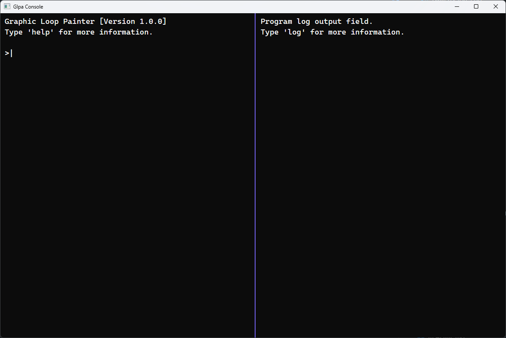

## GLPA
[GlpaLib.sln](GlpaLib/GlpaLib.sln)を立ち上げ、`GlpaLib`プロジェクトを実行することで使用できます。
ビルドには`CUDA ToolKit`のダウンロードが必要です。
プログラムはVisual Studioから実行停止を行わなければ、現状ではエラーが起きるため注意してください。

## 実行結果
以下のウィンドウに入力を行うことでウィンドウを開けることができます。

`base create base_a`と入力すると以下のウィンドウが開き、各四角形を左クリックで移動させれます。

`base create base_b`と入力すると以下のウィンドウが開きます。。objファイルを読み込みCUDAを使用したGPU処理でラスタライズまで行っています。

